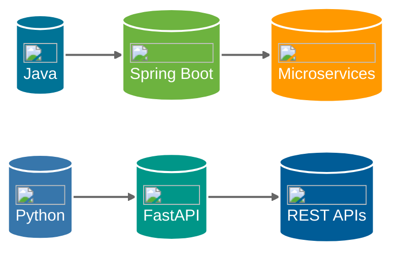

# 🙏🏻 Renuka Devi Mata Ki Jai 🙏🏻

  
  

---

<h2>💫 Welcome to My Digital Garden! 💫</h2>

<table>
<tr>
<td align="center" style="padding: 15px; background: linear-gradient(135deg, #1e3c72 0%, #2a5298 100%); border-radius: 10px;">
  <strong style="color: white;">🎯 Full-Stack Developer</strong>
</td>
<td align="center" style="padding: 15px; background: linear-gradient(135deg, #2c3e50 0%, #3498db 100%); border-radius: 10px;">
  <strong style="color: white;">🏗️ Microservices Architect</strong>
</td>
<td align="center" style="padding: 15px; background: linear-gradient(135deg, #16222a 0%, #3a6073 100%); border-radius: 10px;">
  <strong style="color: white;">🌟 Open Source Enthusiast</strong>
</td>
</tr>
</table>

## 👨‍💻 Who Am I?

> *"Clean code always looks like it was written by someone who cares."*  
> \- Robert C. Martin

I'm a **Full-Stack Developer** and **Microservices Backend Architect** with a passion for building scalable, efficient, and maintainable systems. I specialize in crafting robust solutions using modern technologies and best practices.

### 🎯 Professional Focus

<table style="width: 100%; border-collapse: separate; border-spacing: 10px;">
<tr>
<td align="center" style="background: linear-gradient(135deg, #1e3c72 0%, #2a5298 100%); padding: 20px; border-radius: 10px; color: white;">
  <h3>🏗️ Architecture</h3>
  
Scalable Microservices

</td>
<td align="center" style="background: linear-gradient(135deg, #2c3e50 0%, #3498db 100%); padding: 20px; border-radius: 10px; color: white;">
  <h3>🔒 Security</h3>
  
Robust Security Practices

</td>
<td align="center" style="background: linear-gradient(135deg, #16222a 0%, #3a6073 100%); padding: 20px; border-radius: 10px; color: white;">
  <h3>🚀 Performance</h3>
  
System Optimization

</td>
<td align="center" style="background: linear-gradient(135deg, #0f2027 0%, #203a43 100%); padding: 20px; border-radius: 10px; color: white;">
  <h3>📊 Data</h3>
  
Efficient Data Models

</td>
</tr>
</table>

## 🔥 Current Endeavors

  

    

      <h3>🎓 Building TCF</h3>
      
Revolutionary software training platform for upskilling developers

    

    

      <h3>🌟 Open Source</h3>
      
Active contributor to Spring Boot (Java SDK)

    

    

      <h3>📚 Learning</h3>
      
Exploring Cloud Native architectures & AI/ML integration

    

  

  

    
  

## 🛠️ Technology Arsenal

### Backend Development

### Frontend & Mobile Development

  

    <h3>Web Development</h3>
    

      
      
      
      
    

  

  

    <h3>Mobile Development</h3>
    

      
      
      
    

  

### Database & Infrastructure

  

    <h3>Databases</h3>
    

      
      
      
      
    

  

  

    <h3>Cloud & DevOps</h3>
    

      
      
      
      
    

  

## 📊 GitHub Analytics

  

    
  

  

    
  

  

    
  

## 🌱 Contribution Garden

  

## 🎯 Quick Facts

  

    <h3>🌟 Open Source Enthusiast</h3>
    
Contributing to make the developer world better

  

  

    <h3>📚 Continuous Learner</h3>
    
Always exploring new technologies

  

  

    <h3>🎮 Work-Life Balance</h3>
    
Cricket enthusiast and retro gaming lover

  

  

    <h3>☕ Powered by</h3>
    
Cold brew coffee and lo-fi beats

  

## 🤝 Let's Connect!

  
  
  

---

### 📩 Open for Collaboration!

*"The best way to predict the future is to create it."*

