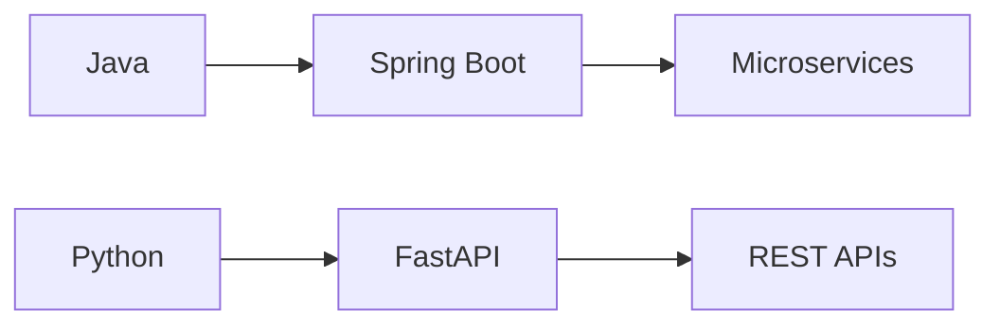

# 🙏🏻 जय माता दी 🙏🏻

## 👨‍💻 Who Am I?

> *"Clean code always looks like it was written by someone who cares."* - Robert C. Martin

I'm a **Full-Stack Developer** and **Microservices Backend Architect** with a passion for building scalable, efficient, and maintainable systems. I specialize in crafting robust solutions using modern technologies and best practices.

### 🎯 Professional Focus
- 🏗️ **Architecture**: Designing scalable microservices architectures
- 🔐 **Security**: Implementing robust security practices
- 🚀 **Performance**: Optimizing system performance and reliability
- 📊 **Data**: Creating efficient data models and workflows

## 🔥 Current Endeavors

<table>
  <tr>
    <td>🎓 Building TCF</td>
    <td>Revolutionary software training platform for upskilling developers</td>
  </tr>
  <tr>
    <td>🌟 Open Source</td>
    <td>Active contributor to Spring Boot (Java SDK)</td>
  </tr>
  <tr>
    <td>📚 Learning</td>
    <td>Exploring Cloud Native architectures & AI/ML integration</td>
  </tr>
</table>

## 🛠️ Technology Arsenal

### Backend Development

### Frontend & Mobile

| Web Development | Mobile Development |
|:---------------:|:------------------:|
| React.js | Flutter |
| Tailwind CSS | React Native |
| HTML5/CSS3 | Firebase |

### Database & Infrastructure

| Databases | Cloud & DevOps |
|:---------:|:-------------:|
| PostgreSQL | Docker |
| MongoDB | Kubernetes |
| MySQL | Apache Kafka |
| Firebase | Linux |

## 📊 GitHub Analytics

| GitHub Streaks 🔥 | GitHub Stats 📈 | Languages 🚀 |
|:-----------------:|:---------------:|:------------:|
|  |  |  |

## 🌱 Contribution Garden

## 🎯 Quick Facts

- 🌟 **Open Source Enthusiast**: Contributing to make the developer world better
- 📚 **Continuous Learner**: Always exploring new technologies
- 🎮 **Work-Life Balance**: Cricket enthusiast and retro gaming lover
- ☕ **Powered by**: Cold brew coffee and lo-fi beats

## 🤝 Let's Connect!

---

### 📫 Open for Collaboration!

*"The best way to predict the future is to create it."*

